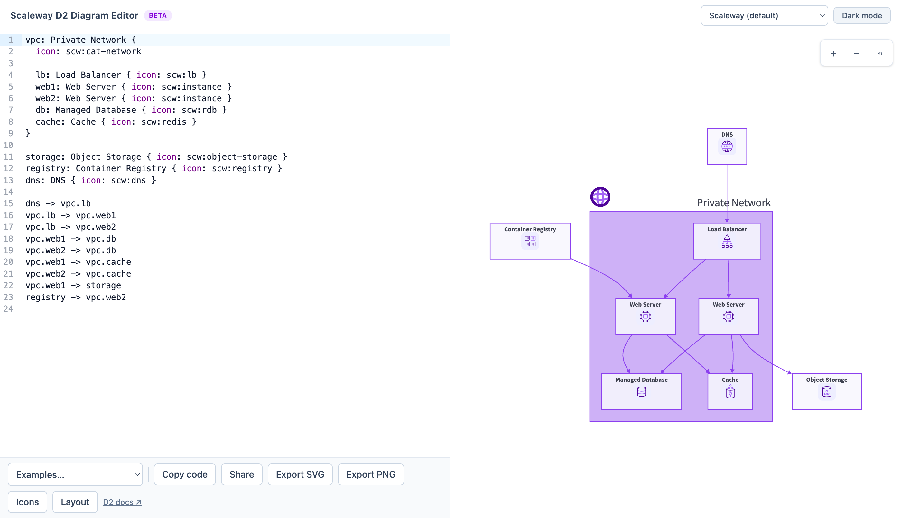

# Scaleway D2 Diagram Editor (beta)

> [!IMPORTANT]
> **Unofficial proof of concept.** This is an independent, community project — it is not built, maintained, or endorsed by Scaleway. It uses Scaleway's public `@ultraviolet/icons` package and brand icon for convenience.

A single-page React app for writing [D2](https://d2lang.com) diagrams with a curated set of Scaleway product icons, live preview, dark/light rendering, and shareable URLs. D2 compiles and renders entirely in the browser via [`@terrastruct/d2`](https://github.com/terrastruct/d2/tree/master/d2js/js)'s WebAssembly build (the same approach as the official [D2 Playground](https://play.d2lang.com)) — no backend, no server-side rendering. Built with Bun + Vite, deployed as a static site to GitHub Pages.

Sibling project: `scw-mermaid` does the same thing for Mermaid `architecture-beta` diagrams.



## Features

- D2 source editor (left, CodeMirror with syntax highlighting) with a live-rendered preview (right)
- Toolbar: copy source, copy a shareable link, export as SVG or PNG, and a diagram layout panel (layout engine, sketch mode)
- A diagram theme picker: Scaleway's own purple-branded theme (default, follows the app's light/dark toggle automatically) or any of D2's ~20 built-in numbered themes
- Diagram state (source, theme, layout, sketch mode) is encoded in the URL for sharing/reloading. Theme/layout settings are kept out of the editable source itself — they're prepended only at compile time — so the editor stays free of a multi-line color block and "Copy code" gives back a clean diagram (shapes/connections only, not the Scaleway color theme)
- ~190 Scaleway icons (compute, storage, network, database, security, ...) available as `icon: scw:icon-name` in diagrams

## Documentation

- [D2 language tour](https://d2lang.com/tour/intro) — full syntax reference (shapes, connections, containers, ...)
- [D2 icons & images](https://d2lang.com/tour/icons) — how the `icon:` field works
- [D2 themes](https://d2lang.com/tour/themes) — built-in themes and the `theme-overrides` mechanism this app uses for its Scaleway theme

The same D2 docs link is also available from the **D2 docs** link in the app's toolbar.

## Getting started

```sh
bun install
bun run dev
```

`bun run dev` and `bun run build` both regenerate the icon pack first (see below), so no manual step is needed.

## The Scaleway icon pack

Scaleway's icons aren't published anywhere D2 can reference by URL, so `scripts/build-icons.ts` renders a curated subset of [`@ultraviolet/icons`](https://www.npmjs.com/package/@ultraviolet/icons) (Scaleway's design system) React components to static standalone SVG files via `react-dom/server`, written to `public/icons/scw/`. Unlike Mermaid's iconify-pack registry, D2's `icon:` field is just a URL — so instead of a repackaged sprite, this app recognizes a `scw:icon-name` shorthand and rewrites it to the real asset path right before compiling (see `src/lib/scwIcons.ts`). Generated files aren't committed — run explicitly with:

```sh
bun run icons
```

The icon set is discovered automatically from every `ProductIcon`/`CategoryIcon` the installed `@ultraviolet/icons` version exports (via `scripts/build-icons.ts`'s `discover()`), rather than a hand-typed map — so upgrading `@ultraviolet/icons` picks up new Scaleway product icons for free. A short `PRODUCT_EXCLUDE`/`CATEGORY_EXCLUDE` list in that script filters out internal codenames, SDK/language logos, and Scaleway Console navigation icons that aren't diagram-relevant. `@ultraviolet/icons` also hardcodes a couple of very slightly different purples across its icon set (and a handful of icons use an inverted dark-badge style instead of the usual light background) — `build-icons.ts` normalizes every icon to one canonical light/mid/dark triad so they read consistently side by side in a diagram, without touching non-Scaleway icons (e.g. a brand logo referenced by a plain URL) that fall outside that known color set.

Reference an icon in a diagram as `scw:<name>`, e.g.:

```
db: Managed Database {
  icon: scw:rdb
}
```

Browse the full set live in the app via the **Icons** toolbar button — it lists every available `scw:<name>`, with a preview, a filter box, and click-to-copy.

## Deployment

Pushing to `main` builds the app and deploys `dist/` to GitHub Pages via `.github/workflows/deploy.yml`. On a fresh repo, enable it once under **Settings → Pages → Source: GitHub Actions**.

## Contributing

Contributions are welcome — see [CONTRIBUTING.md](CONTRIBUTING.md) for how to get set up. Please also read the [Code of Conduct](CODE_OF_CONDUCT.md). For security issues, see [SECURITY.md](SECURITY.md) instead of opening a public issue.

## License

[MIT](LICENSE)
